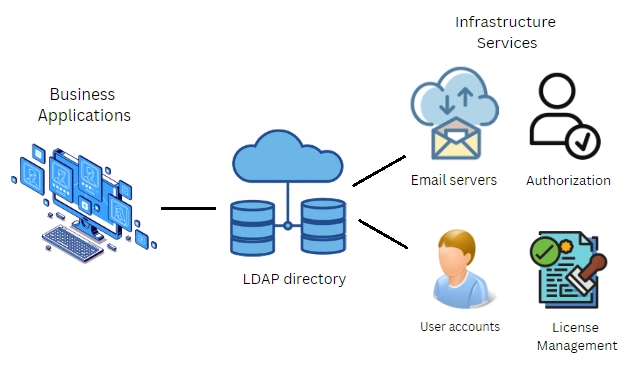

## 1. Task Requirement

 1. Install and configure Ldap 389 DS in the containerised platform with persistence storage
 2. Create organisation keenable.in   
 3. Create OU [Dev,Support,POC, Document, Observability]
 4. Create group Admin,Support
 5. Create custom attribute

## 2. Environment Detail

- #### Server Info:-
    Os version
    NAME="Ubuntu"
    VERSION="20.04.6 LTS (Focal Fossa)"
    podman version 3.4.2

- #### Client Info:-
    NAME="Ubuntu"
    VERSION="20.04.6 LTS (Focal Fossa)"

## 3. List of Tools:-
1. Podman
2. Ldap
3. Apache Directory Studio

**Ldap version:- 3**
 Apache Directory Studio version:- 2.0.0.v20210717-M17

## 4. Definition of tools

#### Podman

Podman is an open-source containerization tool that manages containers and images, supporting features like pod management, rootless containers, and a daemonless architecture.
   
#### LDAP

SSThe Lightweight Directory Access Protocol is a communication protocol used to access directory servers and is used to store, update and retrieve data from a directory structure.

#### Apache Directory Studio

Apache Directory Studio is an open-source LDAP client with a graphical interface for managing and interacting with LDAP directories.

## 5. Command for the setup or configuration

### [5.1]. Create Bash script for create Pod and container
    cat  ldap.sh
    Bash script :-
    #!/bin/bash
    #create pod with name ldap389
    podman pod create --name ldap389 --publish 3389:3389 --publish 3636:3636
    #create container
    podman run -dt\
    --pod ldap389 \
    --name 389ds-ldap \
    -v ~/389ds/data:/data \
    -e DS_SUFFIX=dc=keenable, dc=in \
    -e DS_DM_PASSWORD=<password> \
    docker.io/389ds/dirsrv
    >In Pod we have set port 3389 and 3636
    >In container we have set base Dn as keenable.in and set password of dn

#####  a. Check container list

    cmd:- podman ps -a –pod

##### b. Install Ldap utility on bash machine

    cmd:- sudo apt install ldap-utils

### [5.2].  Setup ApacheDirectory studio for ldap db UI

**a. Install ApacheDirectory studio tar file and extract in directory**

 **b. Go to new connection and enter some details**
    ldap connection name
    Hostname
    ldap port > Press next 
    Enter Bind DN name (cn= Directory Manager) 
    Enter Bind DN password -> finish

### [5.3].Create Organization_unit ldif file (file extension name , ldif ) 

    cat organisation.ldif

- **we have create 5 organisation ( Dev, Support, POC, Document,    Observability)**

        dn: dc=keenable,dc=in
        objectClass: top
        objectClass: domain
        dc: keenable

        dn: ou=Dev,dc=keenable,dc=in
        objectClass: top
        objectClass: organizationalUnit
        ou: Dev

        dn: ou=Support,dc=keenable,dc=in
        objectClass: top
        objectClass: organizationalUnit
        ou: Support

        dn: ou=POC,dc=keenable,dc=in
        objectClass: top
        objectClass: organizationalUnit
        ou: POC

        dn: ou=Document,dc=keenable,dc=in
        objectClass: top
        objectClass: organizationalUnit
        ou: Document

        dn: ou=Observability,dc=keenable,dc=in
        objectClass: top
        objectClass: organizationalUnit
        ou: Observability

- >>> Run this command to add **"organisation.ld"**
 	
        ldapadd -a -c -xH ldap://localhost:3389 -D "cn=Directory Manager" -W  -f organisation.ldif

### [5.4]. Create 2 group inside Support 
    cat  group.ldif

    dn: cn=Admins,ou=Support,dc=keenable,dc=in
    objectClass: top
    objectClass: groupOfUniqueNames
    cn: Admins
    uniqueMember: uid=user1,ou=Support,dc=keenable,dc=in

    dn: cn=SupportTeam,ou=Support,dc=keenable,dc=in
    objectClass: top
    objectClass: groupOfUniqueNames
    cn: SupportTeam
    uniqueMember: uid=user2,ou=Support,dc=keenable,dc=in

 >>> Run this command to add **"organisation.ldif"**
        
    ldapadd -a -c -xH ldap://localhost:3389 -D "cn=Directory Manager" -W  -f group.ldif

### [5.5]. Run some Command of ldap

- **a. First check how many default object class created**

         ldapsearch -o ldif-wrap=no -xH ldap://localhost:3389 -D "cn=Directory Manager" -w "redhat@" -b "cn=schema" '(objectClass=subSchema)' -s sub objectclasses

- **b. Check how many default attributes created**

        ldapsearch -o ldif-wrap=no -xH ldap://localhost:3389 -D "cn=Directory Manager" -w "redhat@" -b "cn=schema" '(objectClass=subSchema)' -s sub attributetypes

### [5.6].  Create Custom attribute according to our requirement

- **a. Create customer attribute ldif file**

        Example:-

        dn: cn=schema
        changetype: modify
        add: attributeTypes
        attributetypes: (emp_code-oid NAME  'EmployeeCode' DESC 'EmployeeCode' EQUALITY caseIgnoreMatch SUBSTR caseExactSubstringsMatch SYNTAX 1.3.6.1.4.1.1466.115.121.1.15{10} SINGLE-VALUE X-ORIGIN 'user defined' )
        attributetypes: (gender-oid NAME 'Gender' DESC 'Gender' EQUALITY caseIgnoreMatch SUBSTR caseExactSubstringsMatch SYNTAX 1.3.6.1.4.1.1466.115.121.1.15{8} SINGLE-VALUE X-ORIGIN 'user defined')
        attributetypes: (certifications-oid NAME 'Certifications' DESC 'Certifications' EQUALITY caseIgnoreMatch SUBSTR caseExactSubstringsMatch SYNTAX 1.3.6.1.4.1.1466.115.121.1.15{10} X-ORIGIN 'user defined')
        attributetypes: (passport-oid NAME 'PassportNo'  DESC 'PassportNo.' EQUALITY caseIgnoreMatch SUBSTR caseExactSubstringsMatch SYNTAX 1.3.6.1.4.1.1466.115.121.1.15{10}  SINGLE-VALUE X-ORIGIN 'user defined')
        attributetypes: (pan_no-oid NAME 'Panno' DESC 'Panno.' EQUALITY caseIgnoreMatch SUBSTR caseExactSubstringsMatch SYNTAX 1.3.6.1.4.1.1466.115.121.1.15{10}  SINGLE-VALUE X-ORIGIN 'user defined')
        attributetypes: (qualification-oid NAME 'Qualification' DESC 'Qualification' EQUALITY caseIgnoreMatch  SUBSTR caseExactSubstringsMatch SYNTAX 1.3.6.1.4.1.1466.115.121.1.15{10} X-ORIGIN 'user defined')
        attributetypes: (correspondence_address-oid  NAME 'CorrespondenceAddress' DESC 'CorrespondenceAddress' EQUALITY caseIgnoreMatch SUBSTR caseExactSubstringsMatch SYNTAX 1.3.6.1.4.1.1466.115.121.1.15{100} SINGLE-VALUE X-ORIGIN 'user defined')

- **b. Add this file to ldap db**

        ldadadd -a -c -xH ldap://localhost:3389 -D "cn=Directory Manager" -W  -f < attribute file>

- **c. Create Object class file for add attribute to object class**

        dn: cn=schema
        changetype: modify
        add: objectClasses
        objectClasses: ( customEmployee-oid NAME 'customEmployee' SUP top STRUCTURAL MUST ( EmployeeCode $ DateofJoining $ Gender $ DateofBirth $ Panno $ Qualification $ YearsofQualification $ ProfessionalStartYEARS $ YEARSOfExperience $ CorrespondenceAddress $ personalemail-id $ mobileno $ MaritalStatus $ BankName $ AccountNo $ IFSCCode $ documentssubmitted) MAY ( DateOfResignation $ Certifications $ PassportNo $ PassportValidupto $ AadhaarNo $ facebookaccount $ twitteraccount $ Childinfo $ pfno $ UANno $ ESICCardNo $ InsuranceMonthlyAmountDeductionINR $ FamilyMembersInsured $ dateofjoiningasintern $ ProjectName )  X-ORIGIN 'user defined')

- **d. Add object class ldif file**

        ldadadd -a -c -xH ldap://localhost:3389 -D "cn=Directory Manager" -W  -f <objectclass name>

### [5.7]. Create user with custom attribute
	    cat  **custom_attribute.ldif**
        dn: uid=001,ou=dev,dc=keenable,dc=in
        objectClass: top
        objectClass: inetOrgPerson
        objectClass: customEmployee
        cn: rahul
        sn: Gupta
        uid: 001
        EmployeeCode: 101
        userPassword: 12345@
        personal email-id: rahulgupta@yopmail.com
        mobileNo: 1213141500
        documentssubmitted: yes
        DateofJoining: 05-01-2022
        Gender: Male
        DateofBirth: 06-01-1998
        Panno: ABCDH7654P
        Qualification: MCA
        YearsofQualification: 2021
        ProfessionalStartYEARS: 2022
        YEARSOfExperience: 01
        CorrespondenceAddress: Delhi
        MaritalStatus: Single
        BankName: PNB
        AccountNo: 1100110011
        IFSCCode: KKBK0053
        > In this file we have gave objectclass name and must custom attribute
    
- **a. After that add user to db**

        ldapadd -a -c -xH ldap://localhost:3389 -D "cn=Directory Manager" -W  -f custom_attribute.ldif

- **b. Check user reflected or not through ldapsearch command**

        ldapsearch -x -D "cn=Directory Manager" -W -H ldap://192.168.29.221:3389 -b "ou=dev,dc=keenable,dc=in" -s sub "(uid=001)"

Output look like th

        # extended LDIF
        #
        # LDAPv3
        # base <ou=dev,dc=keenable,dc=in> with scope subtree
        # filter: (uid=001)
        # requesting: ALL
        #

        # 001, dev, keenable.in
        dn: uid=001,ou=dev,dc=keenable,dc=in
        objectClass: top
        objectClass: inetOrgPerson
        objectClass: customEmployee
        objectClass: organizationalPerson
        objectClass: person
        objectClass: posixAccount
        cn: rahul
        sn: Gupta
        uid: 001
        EmployeeCode: 101
        personalemail-id: rahulgupta@yopmail.com
        mobileno: 1213141500
        documentssubmitted: yes
        DateofJoining: 05-01-2022
        Gender: Male
        DateofBirth: 06-01-1998
        Panno: ABCDH7654P
        Qualification: MCA
        YearsofQualification: 2021
        ProfessionalStartYEARS: 2022
        YEARSOfExperience: 01
        CorrespondenceAddress: Delhi
        MaritalStatus: Single
        BankName: PNB
        AccountNo: 1100110011
        IFSCCode: KKBK0053
        userPassword:: e1BCS0RGMi1TSEE1MTJ9MTAwMDAkcDFieEFwaDlIR1FCV1lYcEtUTlhZRlliK2J 3VzZwWVMkQTRmSWJnb0QxOE95cnptSUZUYVY2UUNYVnVPeVRiaWxLLytOSjg1cUlNbm9BRUZrZjhG
        TVoraWtuSUhBR3B6M1BnaWVtOWxsN0UvbDJiYnlQSi94ZFE9PQ==
        uidNumber: 1
        gidNumber: 1
        homeDirectory: /home/

        # search result
        search: 2
        result: 0 Success

        # numResponses: 2
        # numEntries: 1

### [5.8]. Setup ldap Client on another VM

     a. Install package related to ldap client

        Cmd:- sudo apt -y install libnss-ldap libpam-ldap ldap-utils

     b. After run this command we get one pop up screen

        > Enter LDAP URI:  IP address or hostname
        > Enter Set a Distinguished name(dn) of the search base

     c. Open /etc/nslcd.conf and check configuration 

            uid nslcd
        gid nslcd
        uri ldap: ldap server ip or hostname
        Hostname
        base dc =,dc=  # acc to server base Dn

     d. Restart nslcd and nscd service 

     e. Run getent passwd command to check server user reflect or not

        getent passwd | grep 001
        001:*:1:1:rahul:/home/:

## 6. LDAP architecture diagram

## 7. Reference Link:-

For Understand Ldap:- https://www.windows-active-directory.com/active-directory-ldap.html

For Attribute Syntax:- https://ldap.com/attribute-syntaxes/

For Client Setup:- https://computingforgeeks.com/how-to-configure-ubuntu-as-ldap-client/?expand_article=1&expand_article=1

